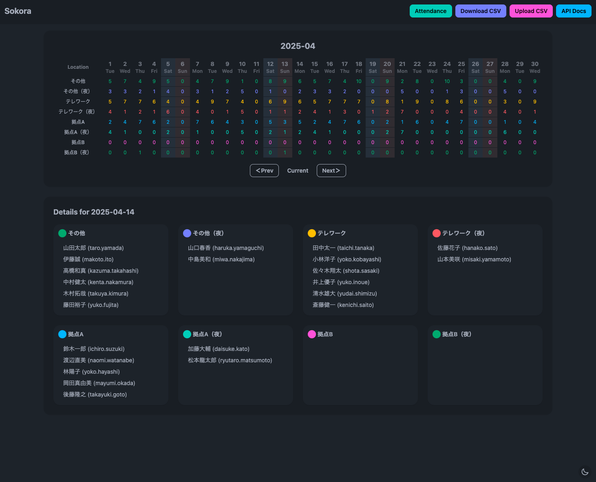

# sokora



直感的なカレンダー UI で勤怠（リモート / オフィス / 休暇など）を可視化・編集する Web アプリ。HTMX + Alpine.js で軽量に動き、FastAPI + SQLite でシンプルに運用。

## Features
- 月次/週次カレンダー、日別詳細、勤怠種別ごとの色分け表示
- HTMX モーダルによる勤怠 CRUD とマスタ管理（ユーザー / グループ / 勤怠種別 / 社員種別）
- CSV インポート/エクスポート、月次・年度別の集計ビュー
- 祝日キャッシュ表示とカスタム祝日管理（DB 保存で再ビルド後も保持）
- 任意で有効化できる認証ガード（Keycloak OIDC + 管理者向けローカルログイン）

## Stack
- Backend: Python 3.13 / FastAPI / SQLAlchemy / Pydantic v2 / SQLite
- Frontend: Jinja2 (SSR) + HTMX + Alpine.js + Tailwind CSS (daisyUI)
- Tooling: Poetry, pytest + pytest-playwright, mypy, ruff, Tailwind ビルド用 Node
- Runtime: Docker（multi-stage build）。ポートは `SERVICE_PORT` で指定。

## Quick Start（ローカル/Dev Container）
1) `.env.sample` をコピーして `.env` を用意し、少なくとも `VERSION`（任意のタグ）と `SERVICE_PORT` を埋める  
2) 依存と開発用アセットを準備:  
```bash
make install   # poetry install + builder npm ci + assets/ と祝日キャッシュを生成
```
3) アプリ起動（ホットリロード）:  
```bash
make run       # http://localhost:${SERVICE_PORT}
```
   - Makefile は `VERSION` 未設定だとエラー。`.env` に必ず設定する。
   - `data/sokora.db` が無ければ起動時に自動でテーブル作成とシーディング（60日/60日分）を実施。
4) 停止: `make docker-stop`（コンテナ実行時）またはサーバープロセスを終了

静的スタイルを触る場合は `builder/input.css` を編集し、`make assets` で `assets/` を再生成（ビルド成果物は直接編集しない）。

## Docker
- プロダクションビルド: `make docker-build`（タグは `.env` の `VERSION`）  
- 実行: `make docker-run`（`data/` をボリュームマウント、ビルド済み DB が無ければ初回にコピー）  
- プロキシ経由は `proxy` を `.env` に設定し、`make docker-build-proxy` / `make docker-run-proxy`

## Authentication
- デフォルトは `SOKORA_AUTH_ENABLED=false` でガード無効。オンにすると UI/API 両方にセッション必須。
- ローカル管理者ログインは `SOKORA_LOCAL_ADMIN_USERNAME/PASSWORD` が揃っていると有効。
- OIDC は `OIDC_ISSUER/CLIENT_ID/CLIENT_SECRET/OIDC_REDIRECT_URL` などを設定して有効化し、ログイン画面で Keycloak 経路とローカル管理者を並列表示する。OIDC のオン/オフ状態は `SOKORA_AUTH_STATE_PATH`（デフォルト `data/auth_state.json`）に保存される。
- セッション秘密鍵は `SOKORA_AUTH_SESSION_SECRET` を本番用に差し替える。

## Environment Variables
| Name | Default | Description | Example |
| --- | --- | --- | --- |
| SERVICE_PORT | 8000 | アプリ公開ポート | 8000 |
| VERSION | なし (必須) | Docker イメージタグ（Makefile が必須扱い） | 1.0.0 |
| proxy | なし | Docker ビルド/実行時のプロキシ URL | http://proxy.local:8080 |
| SOKORA_LOG_LEVEL | INFO | ログレベル | DEBUG |
| SOKORA_AUTH_ENABLED | false | 認証ガードの有効/無効 | true |
| SOKORA_AUTH_SESSION_SECRET | dev-session-secret | セッション署名キー | change-me-prod-secret |
| SOKORA_AUTH_SESSION_TTL_SECONDS | 3600 | セッション有効期限（秒） | 7200 |
| SOKORA_LOCAL_AUTH_ENABLED | true | ローカル管理者認証の有効/無効 | false |
| SOKORA_LOCAL_ADMIN_USERNAME | なし | ローカル管理者ユーザー名 | admin |
| SOKORA_LOCAL_ADMIN_PASSWORD | なし | ローカル管理者パスワード | strong-password |
| SOKORA_AUTH_STATE_PATH | data/auth_state.json | OIDC 有効/無効トグルの保存先 | /app/data/auth_state.json |
| OIDC_ISSUER | なし | OIDC IdP issuer | https://keycloak.example.com/realms/sokora |
| OIDC_CLIENT_ID | なし | OIDC クライアント ID | sokora-web |
| OIDC_CLIENT_SECRET | なし | OIDC シークレット | super-secret |
| OIDC_REDIRECT_URL | なし | OIDC リダイレクト URL | http://localhost:8000/auth/callback |
| OIDC_SCOPES | openid profile email | 要求スコープ | openid profile email offline_access |
| OIDC_HTTP_TIMEOUT | 3.0 | OIDC HTTP タイムアウト秒 | 5.0 |
| OIDC_AUTHORIZATION_ENDPOINT | なし | Authorization Endpoint の上書き | https://.../protocol/openid-connect/auth |
| OIDC_TOKEN_ENDPOINT | なし | Token Endpoint の上書き | https://.../protocol/openid-connect/token |
| OIDC_USERINFO_ENDPOINT | なし | UserInfo Endpoint の上書き | https://.../protocol/openid-connect/userinfo |
| OIDC_LOGOUT_ENDPOINT | なし | Logout Endpoint の上書き | https://.../protocol/openid-connect/logout |
| SEED_DAYS_BACK | 60 | シードする過去日の日数 | 30 |
| SEED_DAYS_FORWARD | 60 | シードする未来日の日数 | 30 |

## Tests
```bash
make test
```
`scripts/testing/run_test.sh` が DB クリーンアップ → API/ユニット → E2E を順に実行し、サーバーが無ければ自動起動する（テスト中は `SOKORA_AUTH_ENABLED=false` を強制）。

## Project Layout
- `app/main.py` / `app/routers/`: API v1 と各ページルーター（auth/calendar/attendance/analysis など）
- `app/templates/`: `layout/base.html` ベースのページ・コンポーネント。HTMX/Alpine.js 用の部分テンプレートは `components/partials/`。
- `app/static/`: 開発用 JS/CSS。`assets/` は Tailwind ビルド成果物。
- `builder/`: Tailwind + daisyUI のビルドソース、`scripts/`: アセット・シーディング・マイグレーション・テスト補助
- `docs/`: [requirements.md](docs/requirements.md) から API/DB/UI 仕様やテンプレート構成へリンク
