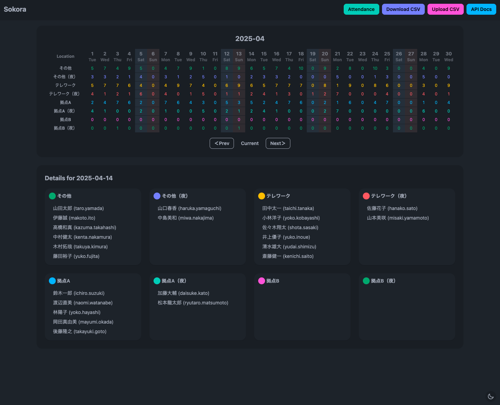

# sokora



勤怠種別・勤務場所をカレンダーUIで可視化・編集するWeb application。FastAPI + SQLAlchemyをbackend、Jinja2 + HTMX/Alpine.jsをSSR UIに利用し、SQLite / PostgreSQLをsupportする。

## Features

- 月次/週次カレンダー、日別詳細、勤怠CRUD
- ユーザー / グループ / 勤怠種別 / 社員種別 / カスタム祝日の管理
- 月次勤怠CSVのダウンロード、月次・年度別の集計
- optionalなOIDC認証 + 管理者向けlocal login
- file-backed SQLiteの管理者向けbackup/restore
- SQLiteのstandalone runtimeと、PostgreSQLを使うmulti-replica runtime
- 共通production OCI imageとclosed-network deployment bundle

## Stack

- Python 3.13
- FastAPI / Jinja2
- HTMX / Alpine.js
- SQLAlchemy / Alembic
- SQLite / PostgreSQL (Psycopg 3)
- Authlib / OpenID Connect
- Tailwind CSS / daisyUI
- uv / Ruff / mypy / pytest / Playwright

## Quick start

`.env.sample`を`.env`へcopyし、少なくとも`VERSION`を設定する。必要に応じて`SERVICE_PORT`や`DATABASE_URL`等を変更する。

```bash
cp .env.sample .env
# .env の VERSION を設定
make install
make run
```

既定のlocal DBは`sqlite:///data/sokora.db`。application startup時にAlembic migrationを適用し、新規file-backed SQLiteだけinitial seedを作成する。

主なdevelopment command:

```bash
make run          # development server
make test         # test suite
make quality      # Ruff + format check + mypy
make format       # Ruff format/import fix
make assets       # frontend assets build
make migrate      # Alembic upgrade head
```

commandの正確な定義と追加targetは`Makefile`を参照する。

## Production

root `Dockerfile`から生成する1種類のprovider非依存OCI imageをproduction artifactとする。runtimeは`PORT`、`DATABASE_URL`、`SOKORA_*`、`OIDC_*`等をenvironment/secretとして受け取る。

```bash
make docker-build
make docker-run
```

closed-network向けには同じimageからrepository-free bundleを生成できる。

```bash
make closed-bundle
```

現時点でclosed-network deployment adapterは実装済み。GCP Cloud Run / AWS managed container / Azure managed containerはplannedで、詳細なsupport statusは [Deployment guide](docs/deployment.md) を参照する。

## Documentation

最初に [Documentation guide](docs/README.md) を参照する。ADRと画像を除き、主要文書は`docs/`直下へ集約している。

- [Cross-cutting requirements](docs/requirements.md)
- [API requirements](docs/api.md)
- [Database requirements](docs/database.md)
- [UI requirements](docs/ui.md)
- [Template/static layout](docs/templates.md)
- [Deployment guide](docs/deployment.md)
- [Production runtime](docs/runtime.md)
- [Closed-network deployment](docs/closed-deployment.md)
- [SQLite database management](docs/sqlite-database-management.md)
- [Architecture Decision Records](docs/adr/README.md)

READMEはproject入口に限定し、DB/auth/deployment等の詳細contractは各SSoTへ集約する。

## Repository layout

```text
app/
  routers/pages/    HTML / HTMX adapters
  routers/api/v1/  JSON API adapters
  services/        use case / transaction coordination
  crud/            database access
  models/ + db/    persistence model/runtime
  templates/       Jinja templates
  static/          application static source
scripts/
  migration/       Alembic
  seeding/         seed
  testing/         test runner
deploy/closed/     closed-network adapter assets
docs/              requirements / runtime / operations / ADR
builder/           Tailwind build source
```

Coding agent向けのrepository固有ruleは [AGENTS.md](AGENTS.md) を参照する。
