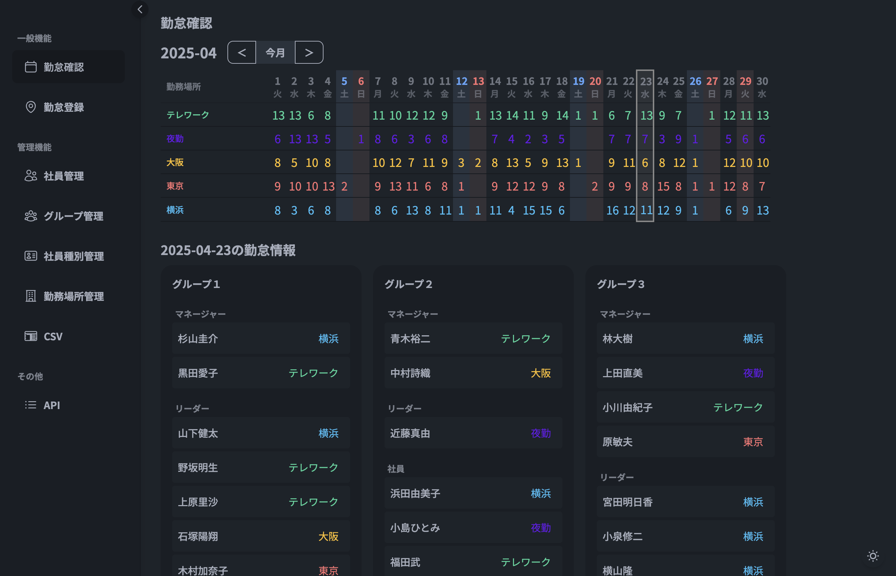

# sokora



直感的なカレンダー UI で勤怠（リモート / オフィス / 休暇など）を可視化・編集する Web アプリケーションです。HTMX + Alpine.js で軽量なインタラクションを実現し、FastAPI + SQLite でシンプルに運用できます。

## 主な機能
- カレンダー表示: 月次ビュー、日別詳細、勤怠種別ごとの色分け表示
- 勤怠登録・編集: HTMX モーダルで高速入力、月・週の選択状態を保存
- マスタ管理: ユーザー / グループ / 勤怠種別 / 社員種別の CRUD
- CSV 入出力: 勤怠データのエクスポート / インポート
- 集計: `/analysis` で月次・年度別の勤怠集計、種別別の詳細ビュー
- 祝日表示: ビルド時に取得した祝日キャッシュを表示・判定に利用

## 技術スタック
- Backend: Python 3.13, FastAPI, SQLAlchemy, Pydantic v2, SQLite
- Frontend: Jinja2 (SSR), HTMX, Alpine.js, Tailwind CSS + daisyUI
- Build: Poetry, Tailwind ビルド用 Node（Docker multi-stage）
- Infra: Docker / docker-compose（ポートは `SERVICE_PORT` 環境変数で指定）

## ディレクトリ概要
- `app/main.py`: FastAPI エントリーポイント（静的/ビルド資産のマウント、ルーター登録）
- `app/routers/api/v1/`: JSON API（勤怠・ユーザー・グループ・種別・CSV）
- `app/routers/pages/`: HTML/HTMX ページ（top, calendar, attendance, register, analysis など）
- `app/templates/`: レイアウト/コンポーネント/ページテンプレート
- `app/static/`: 開発用 JS/CSS（`calendar.js`, `modal.js`, `analysis.js` など）
- `assets/`: ビルド成果物（`assets/css/main.css`, `assets/js/htmx.min.js` 等）
- `builder/`: Tailwind + daisyUI 設定とビルドソース（`input.css`）
- `scripts/`: 祝日キャッシュ取得、シーディング、マイグレーション、テストスクリプト
- `data/`: 本番/開発用 SQLite DB (`sokora.db`)

## セットアップ（Docker / Makefile）
1. `.env.sample` を参考に `.env` を作成し、`SERVICE_PORT` を設定します。
2. ビルドと起動:
   ```bash
   make build      # プロダクションイメージをビルド（DBが無ければビルド時に初期化・シード）
   make run        # SERVICE_PORT で uvicorn を起動（devcontainer でも同様）
   ```
   - `data/sokora.db` が存在しない場合は、`make run` / `make docker-run` の起動時にテーブル作成とシーディング（60日/60日分）を自動実行します。Docker ビルド済みイメージにはシード済み DB が `/app/seed/sokora.db` として同梱され、`make docker-run` でホストマウントされた `data/` が空ならエントリポイントがコピーします。
3. アクセス: `http://localhost:${SERVICE_PORT}`
4. 停止: `make stop`

### 開発用コンテナ（devcontainer と共通）
- イメージビルド: `make dev-build`
- サーバ起動（ホットリロード）: `make run`
- シェルで作業: `make dev-shell`
- 本番コンテナ実行前に `make docker-build`（DBが無い場合はビルド時に初期化・シード）→ `make docker-run`（ホストの `data/` をバインド）

> 備考: Docker ビルド時に Tailwind ビルドと祝日キャッシュ取得を実行し、`assets/` に成果物を配置します。ビルド生成物を直接編集しないでください。必要な場合は `make assets` で再生成します。
> devcontainer 起動直後は Web サーバーを立ち上げずポートもフォワードしません。`make run` を実行したときに `.env` の `SERVICE_PORT` でホスト側へバインドされます。

## ローカル開発（非コンテナ）
```bash
# 依存関係
poetry install

# アプリ起動（ホットリロード）
uvicorn app.main:app --host 0.0.0.0 --port 8000 --reload
```
- 静的スタイルを変更する場合は `builder/input.css` を編集し、必要に応じて `npx tailwindcss -i builder/input.css -o assets/css/main.css --minify` で再生成してください（Docker ビルドでは自動生成）。

## テスト
総合テストスクリプト（DB クリーンアップ込み）:
```bash
make test
```
- API/ユニットテストは in-memory SQLite を利用します。
- E2E テスト（Playwright）は `http://localhost:8000` へのアクセスが前提なので、`make dev-up` などでアプリを起動してから実行してください。

## シーディング・ユーティリティ
- 勤怠ダミーデータ投入: `make seed` （既存ユーザー・勤怠種別が前提）
- 祝日キャッシュ生成（ビルド時と同等）: `python3 scripts/build_holiday_cache.py`  
  生成物は `assets/json/holidays_cache.json` に保存され、`app/utils/holiday_cache.py` から読み込まれます。

## 開発ポリシー（概要）
- 既存レイヤー（ルーター → サービス → CRUD → モデル）とテンプレート構造を踏襲する。
- スキーマ/API/UI の変更は対応するテストを更新する。
- Dockerfile / docker-compose の大規模変更や外部依存追加は事前合意の上で行う。
