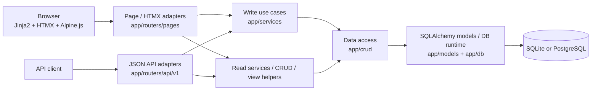

# Architecture

sokoraはFastAPIを中心に、HTML/HTMXとJSON APIを別adapterとして持つserver-rendered applicationです。writeのbusiness ruleとtransactionはservice層へ集約し、persistenceはSQLAlchemy/Alembicで管理します。

## Application flow

page/HTMX adapterはForm input、HTML fragment、`HX-*` responseを担当します。JSON APIはJSON contractを担当し、page adapterからAPIへ内部HTTP requestを送る構成にはしません。

read pathは画面や集計の複雑さに応じてdedicated read service、CRUD、view helperを利用します。新しいlayerを機械的に追加せず、既存責務に合わせます。

## Responsibilities

| Area | 主なpath | Responsibility |
| --- | --- | --- |
| application lifecycle | `app/main.py` | startup/shutdown、middleware、health、router wiring |
| browser adapters | `app/routers/pages/` | SSR、HTMX、Form input、HTML response |
| JSON adapters | `app/routers/api/v1/` | public JSON API |
| use cases | `app/services/` | business rule、write transaction、read model |
| data access | `app/crud/` | query / persistence operation |
| persistence model | `app/models/`, `app/db/` | SQLAlchemy model、engine/session runtime |
| schemas | `app/schemas/` | public/input data shape |
| templates | `app/templates/` | Jinja page / component |
| frontend source | `app/static/`, `builder/` | application JS、Tailwind/daisyUI build source |
| schema migration | `scripts/migration/` | Alembic |
| seed | `scripts/seeding/` | initial/sample data |

## State model

multi-replicaで共有状態として依存してよいものを限定します。

| State | Contract |
| --- | --- |
| application data | shared DB。SQLiteはsingle-instance、multi-replicaはPostgreSQL |
| OIDC editable config | shared DBの`auth_config` |
| session signing / encryption key等 | runtime-injected secret。replica間で同一値 |
| immutable reference data | 同一OCI imageに含まれるasset |
| request中のderived state | request-local |
| DB由来mutable cache | process-global共有stateとして利用しない |

この制約により、write commit後に別replicaへrouteされたreadもshared PostgreSQLから新しいstateを取得できます。厳密なconsistency semanticsは [ADR 0003](adr/0003-multi-replica-runtime.md) を参照してください。

## Related documents

- authentication: [authentication.md](authentication.md)
- database / transaction: [database.md](database.md)
- browser UI: [ui.md](ui.md)
- production runtime: [runtime.md](runtime.md)
- decision history: [adr/](adr/)
