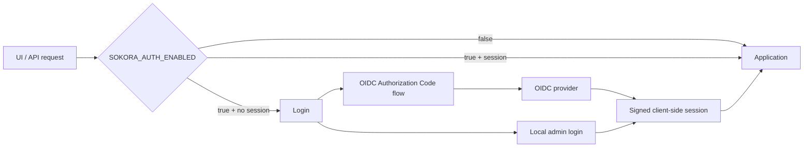

# Authentication

sokoraのauthenticationはoptionalです。一般ユーザーはstandard OIDC、管理者にはOIDCから独立したlocal admin loginを用意します。設計理由は [ADR 0002](adr/0002-authentication-runtime.md) を参照してください。

## Overview

authentication guardが有効な場合、未認証のUI requestは`/auth/login`へredirectし、API requestは401を返します。`/healthz`、authentication flow、static asset、OpenAPIはpublicです。

## Runtime settings

| Setting | Purpose |
| --- | --- |
| `SOKORA_AUTH_ENABLED` | application authentication guard。既定`false` |
| `SOKORA_AUTH_SESSION_SECRET` | signed session secret。auth有効時はdefault/空値を拒否 |
| `SOKORA_AUTH_SESSION_TTL_SECONDS` | session lifetime |
| `SOKORA_AUTH_SESSION_HTTPS_ONLY` | Secure cookie。HTTPS productionでは`true` |
| `SOKORA_LOCAL_AUTH_ENABLED` | local admin経路のenable flag |
| `SOKORA_LOCAL_ADMIN_USERNAME/PASSWORD` | local admin credential |
| `SOKORA_AUTH_CONFIG_ENCRYPTION_KEY` | DB保存するOIDC client secretのFernet key |
| `OIDC_REDIRECT_URL` | OIDC callback URL |
| `OIDC_HTTP_TIMEOUT` | discovery等のHTTP timeout |

`OIDC_ISSUER`、`OIDC_CLIENT_ID`、`OIDC_CLIENT_SECRET`、`OIDC_SCOPES`は、DB-backed設定へ移行する前のlegacy sourceとして利用できます。設定例は [`.env.sample`](../.env.sample)、runtime parserと既定値の実装は `app/core/settings.py` を参照してください。

## OIDC configuration source

`auth_config` singleton rowの有無でsourceを決めます。

| DB state | Effective OIDC source |
| --- | --- |
| rowなし | legacy `OIDC_*` environment |
| rowあり + enabled | shared DB |
| rowあり + disabled | OIDC disabled。environmentへfallbackしない |

最初に`/admin/auth`から保存・disable・unlinkした時点でDB rowが作成され、その後はDBのOIDC設定がenvironment設定より優先されます。

client secretはDBへFernet暗号化して保存します。暗号鍵はDB/imageへ保存せず、`SOKORA_AUTH_CONFIG_ENCRYPTION_KEY`としてruntimeから渡します。multi-replicaでは全replicaへ同じ鍵を設定します。

## OIDC settings page

認証protocol flowは `/auth/*`、管理者向けconfigurationは `/admin/*` に分離します。
`/admin/auth` はlocal admin専用です。

| Operation | Behavior |
| --- | --- |
| Save | issuer / client ID / scope / enable state / client secretを保存 |
| Test | 入力中issuerのstandard discoveryだけを確認。DBは変更しない |
| Disable | DB rowをdisabledとして保持 |
| Unlink | DB rowをdisabled + clearし、legacy environment fallbackを再開しない |

state-changing operationはsession-backed CSRF tokenを要求します。OIDCをenabledで保存する場合は、`openid` scope、client identity/secret、`OIDC_REDIRECT_URL`、standard discovery成功、metadata issuerのexact matchが必要です。

保存済みclient secretはHTML、session、logへ平文で再表示しません。

## Local admin

local adminはbreak-glass管理経路です。`SOKORA_LOCAL_AUTH_ENABLED=true`かつusername/passwordが揃う場合だけ利用できます。

OIDC設定、shared DB上のOIDC secret、IdP discoveryに問題があってもlocal admin credential照合自体はそれらへ依存しません。OIDC failureからlocal adminへ自動failoverはせず、利用者がlogin経路を選択します。

## Session and logout

sessionはStarletteのsigned client-side cookieです。persistent sessionには最小限のidentityだけを保持し、OIDC access token / refresh token / ID tokenは保存しません。

- cookie: HttpOnly + SameSite=Lax
- HTTPS production: Secure cookieを必須化
- login後の`next`: same-origin absolute pathだけを許可
- OAuth state / nonce: authentication flow中だけ一時保持

logoutはapplication sessionを先に破棄します。OIDC sessionの場合だけ、その後の別requestでprovider logoutをbest-effort実行します。shared DBやIdPの停止でlocal logout完了をblockしません。

## Multi-replica

DB-backed OIDC設定はrequest時にshared DBから解決し、process-global mutable cacheを持ちません。runtime-injected session secret / encryption keyはreplica間で同一値にします。

外部IdPへのHTTP待機中にDB connectionを保持しないこともruntime invariantです。
