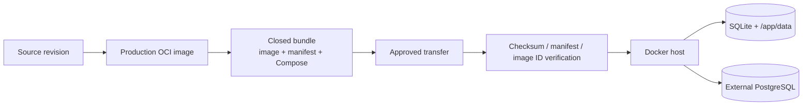

# Closed-network deployment

閉域Dockerサーバー向けには、production imageと実行に必要な最小assetだけをまとめたrepository-free bundleを提供します。runtime hostへsource repositoryやbuild toolingを持ち込む必要はありません。

具体的なoperator commandはbundleへ同梱される [`deploy/closed/README.md`](../deploy/closed/README.md) が正本です。この文書ではdelivery / state / upgrade boundaryを説明します。

## Delivery flow



## Build and package

source checkoutからimageをbuildしてbundle化:

```bash
VERSION=2026.09.09 make closed-bundle
```

すでに別工程でbuildしたimageをpackageする場合、**そのimageをbuildした40文字commit SHA**を明示します。

```bash
VERSION=2026.09.09 \
SOURCE_REVISION=<40-character-build-commit> \
make package-closed-bundle
```

既定出力は`dist/sokora-<version>-closed/`です。

packaging checkoutのHEADをprebuilt imageのprovenanceとして暗黙利用しません。bundle生成はstaging directoryで完了してから出力先を置き換えるため、途中failureでprevious known-good bundleを破壊しません。

## Bundle

| File | Purpose |
| --- | --- |
| `image.tar` | `docker save`したproduction image |
| `image.tar.sha256` | transport checksum |
| `manifest.env` | image reference / image ID / source revision |
| `load-image.sh` | manifest + checksum + loaded image ID verification |
| `compose.sqlite.yaml` | single-instance SQLite runtime |
| `compose.postgresql.yaml` | external PostgreSQL runtime |
| `compose.env.example` | non-secret deployment values |
| `runtime.env.example` | runtime setting / secret placeholders |
| `README.md` | runtime host向けoperator guide |

loaderはmanifestやchecksumの異常を`docker load`前に拒否し、load後もimmutable image IDを照合します。

## Persistent state

bundleはreplace可能なartifactです。mutable stateとsecretはbundle外へ置きます。

| State | Reference location |
| --- | --- |
| deployment values | `/etc/sokora/deployment.env` |
| runtime config / secret | `/etc/sokora/runtime.env` |
| SQLite data | `/var/lib/sokora` → `/app/data` |
| PostgreSQL data | external PostgreSQL |
| image | immutable version tag |

reference operatorでは`runtime.env`を`0600`、deployment envを`0640`とし、`docker compose`を実行するidentityが読めるownershipにします。

## Runtime mode

| Mode | Database | Persistent mount | Replica |
| --- | --- | --- | --- |
| SQLite | `sqlite:///data/sokora.db` | host data dir → `/app/data` | 1 |
| PostgreSQL | explicit `DATABASE_URL` | application data mountなし | surrounding platform次第 |

PostgreSQL Composeは`DATABASE_URL`がblankまたはPostgreSQL scheme以外ならapplication startup前にfailします。設定漏れをdefault SQLiteへfallbackさせません。

SQLite / PostgreSQLの一般的な選択基準は [Deployment](deployment.md) を参照してください。

## Install and start

runtime hostでは次の順で操作します。

1. bundleを搬入
2. `./load-image.sh`でimageを検証・load
3. `runtime.env.example` / `compose.env.example`をpersistent configへinstall
4. runtime secret、port、DB設定を編集
5. SQLiteの場合はpersistent data directoryを作成
6. 選択したCompose fileで`up -d --pull never`
7. `/healthz`と主要user flowを確認

正確な`install` / `docker compose` commandはbundle内 [operator guide](../deploy/closed/README.md) に維持します。

## Upgrade

1. current DB backup / snapshotを取得
2. new bundleを搬入し`load-image.sh`で検証
3. `SOKORA_IMAGE`をnew immutable tagへ変更
4. new bundleの同じCompose modeでcontainerをreplace
5. startup migration完了後に`/healthz`と主要操作を確認
6. acceptanceまでprevious image / bundle / DB backupを保持

startupがAlembic migrationを所有するため、operatorが別系統のmanual schema bootstrapを行いません。

## Rollback

image rollbackとDB rollbackを別物として扱います。

- schema互換が確認できる場合: previous image tagへ戻す
- schema-changing upgrade: applicationを停止し、pre-upgrade DB stateをrestoreしてからprevious imageを起動
- automatic Alembic downgrade: 実行しない

SQLite backupはlive DBの単純copyではなくbackup APIを利用します。PostgreSQLは対象DB基盤のbackup / snapshot機能を利用します。

## Proxy

proxy設定をimageへ焼き込みません。runtimeでは標準`HTTP_PROXY` / `HTTPS_PROXY` / lowercase variants / `NO_PROXY`をenvironmentから渡します。

internal PostgreSQL / OIDC endpoint等、proxyを経由させない宛先はdeployment環境側の`NO_PROXY`へ追加します。

## Validation

`Closed deployment` CIは少なくとも次を検証します。

- repository-free bundle生成
- source revision / checksum / image ID verification
- packaging failure時のprevious bundle保持
- SQLite Composeでの起動と`/healthz`
- PostgreSQL Composeのfail-closed `DATABASE_URL` validation
- bundleへrepository/test/dev toolingを混入させないこと
