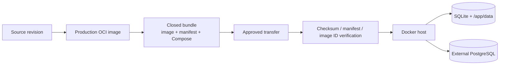

# Closed-network deployment

閉域Dockerサーバー向けには、production imageと実行に必要な最小assetだけをまとめたrepository-free bundleを提供します。runtime hostへsource repositoryやbuild toolingを持ち込む必要はありません。

runtime hostで使う具体的なoperator commandはbundleへ同梱される [`deploy/closed/README.md`](../deploy/closed/README.md) にあります。

## Delivery flow



## Build and package

source checkoutからimageをbuildしてbundle化:

```bash
VERSION=2026.09.09 make closed-bundle
```

すでに別工程でbuildしたimageをpackageする場合は、そのimageをbuildした40文字commit SHAを明示します。

```bash
VERSION=2026.09.09 \
SOURCE_REVISION=<40-character-build-commit> \
make package-closed-bundle
```

既定出力は`dist/sokora-<version>-closed/`です。packaging checkoutのHEADをprebuilt imageのprovenanceとして暗黙利用しません。bundle生成はstaging directoryで完了してから出力先を置き換えるため、途中failureでprevious known-good bundleを破壊しません。

## Bundle contract

| File | Purpose |
| --- | --- |
| `image.tar` | `docker save`したproduction image |
| `image.tar.sha256` | transport checksum |
| `manifest.env` | image reference / image ID / source revision |
| `load-image.sh` | manifest + checksum + loaded image ID verification |
| `compose.sqlite.yaml` | single-instance SQLite runtime |
| `compose.postgresql.yaml` | external PostgreSQL runtime |
| `compose.env.example` | non-secret deployment values |
| `runtime.env.example` | runtime setting / secret placeholders |
| `README.md` | runtime host向けoperator guide |

loaderはmanifestやchecksumの異常を`docker load`前に拒否し、load後もimmutable image IDを照合します。

## Persistent state

bundleはreplace可能なartifactです。mutable stateとsecretはbundle外へ置きます。

| State | Reference location |
| --- | --- |
| deployment values | `/etc/sokora/deployment.env` |
| runtime config / secret | `/etc/sokora/runtime.env` |
| SQLite data | `/var/lib/sokora` → `/app/data` |
| PostgreSQL data | external PostgreSQL |
| image | immutable version tag |

SQLiteはsingle-instance、PostgreSQLはexternal DBを利用します。一般的なdatabase選択条件は [Deployment](deployment.md) を参照してください。

## Operation contract

install、startup、health確認、upgrade、rollbackの具体的なcommandはbundle内operator guideに維持します。この文書では変更時にも維持するcontractだけを示します。

- runtime hostでは`load-image.sh`でmanifest / checksum / loaded image IDを検証する
- persistent config / secret / SQLite dataをbundle directoryから分離する
- SQLite upgrade前はSQLite backup APIによるbackup、PostgreSQLはDB基盤のbackup / snapshotを取得する
- startup migrationはapplicationが所有し、operatorは別系統のmanual schema bootstrapを行わない
- schema-changing upgradeのrollbackではimageだけでなくpre-upgrade DB stateも戻す
- automatic Alembic downgradeは実行しない
- proxyはimageへ焼き込まず、必要なruntimeで標準proxy environmentを設定する

SQLite admin backup/restoreのapplication側contractは [SQLite database management](sqlite-database-management.md)、production startup/healthは [Runtime](runtime.md) を参照してください。

## Validation

`Closed deployment` CIは少なくとも次を検証します。

- repository-free bundle生成
- source revision / checksum / image ID verification
- packaging failure時のprevious bundle保持
- SQLite Composeでの起動と`/healthz`
- PostgreSQL Composeのfail-closed `DATABASE_URL` validation
- bundleへrepository/test/dev toolingを混入させないこと
