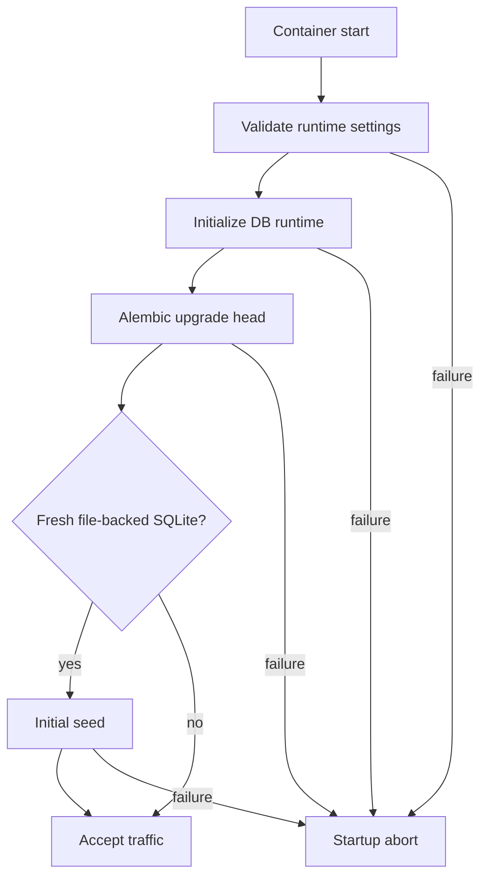

# Runtime

production artifactはroot `Dockerfile`からbuildするprovider-neutral OCI image 1種類です。配置方法は [Deployment](deployment.md) を参照してください。

## Image boundary

| Inside image | Outside image |
| --- | --- |
| application code | SQLite / PostgreSQL data |
| production Python dependencies | runtime secret / credential |
| Alembic migration | environment-specific config |
| fresh SQLite seed code | provider CLI / IaC |
| built static assets / holiday asset | docs / tests / dev tooling |
| container entrypoint | build cache / local source state |

mutable DBやsecretをimage layerへ埋め込みません。

## Runtime inputs

| Input | Purpose |
| --- | --- |
| `PORT` | container listen port。既定8000 |
| `DATABASE_URL` | SQLite / PostgreSQL接続先 |
| `SOKORA_LOG_LEVEL` | application log level |
| `SOKORA_AUTH_*`, `OIDC_*` | authentication / OIDC設定 |
| `HTTP_PROXY`, `HTTPS_PROXY`, `NO_PROXY`等 | 必要な環境だけproxyを注入 |

local host側のport、image version、build proxy等はMake workflowの設定であり、application runtime設定とは分離します。authentication settingの意味とprecedenceは [Authentication](authentication.md)、DB URLは [Database](database.md) を参照してください。

## Startup

production schemaを`Base.metadata.create_all()`で作成しません。

## Health

`GET /healthz`は認証不要のreadiness endpointです。

| Status | Meaning |
| --- | --- |
| `200 {"status":"ok"}` | DB runtimeがrequest処理可能で、`alembic_version`へのreadiness queryが成功する |
| `503 {"status":"unavailable"}` | runtime未初期化、maintenance/fenced、DB unavailable、readiness query failure |

`/healthz`はAlembic revisionがapplicationのcurrent headと一致することまでは検証しません。schema migrationはstartupで`alembic upgrade head`を完了させる前提です。

health responseへexception、credential、filesystem pathを露出しません。OCI `HEALTHCHECK`はcontainer内の`127.0.0.1:$PORT`へ直接接続し、runtime proxy availabilityに依存しません。pure process liveness用`/livez`は提供していません。

## Multi-replica

multi-replicaは全instanceが同じexternal PostgreSQLとruntime secret/configを共有する構成です。DB由来mutable stateをreplica-local cache/fileへ共有状態として持ちません。

詳細は [Architecture](architecture.md) と [ADR 0003](adr/0003-multi-replica-runtime.md) を参照してください。

## Proxy

production imageへproxy valueを固定しません。build/runtimeでproxyが必要な環境は標準proxy variablesを注入し、DB / OIDC / localhost等の除外先を`NO_PROXY`へ設定します。

Docker daemon/client側のproxy設定はapplication runtimeとは別の責務です。

## Environment responsibility

registry、container platform、network、ingress/TLS、identity、secret store、external PostgreSQL provisioning、platform scalingはdeployment environment側で構成します。

特定cloud provider向けSDKやdeployment abstractionをapplication coreへ追加しません。
