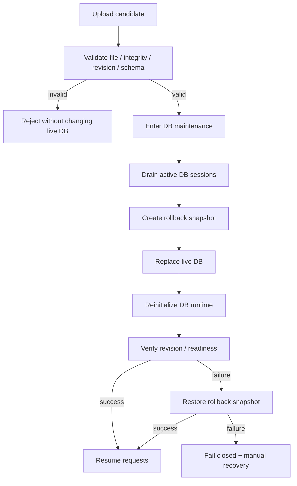

# SQLite database management

`/admin/database`はfile-backed SQLite向けのadmin-only backup / restore UIです。PostgreSQLとin-memory SQLiteでは操作できません。

## Backup

稼働中DB fileを直接copyせず、SQLite backup APIでconsistent snapshotを作成し、integrity check後にdownloadします。

download fileは通常のSQLite DBで、WAL / SHM sidecarを別途必要としません。

## Restore acceptance

restore candidateはlive DBを変更する前に次を検証します。

| Check | Requirement |
| --- | --- |
| file | valid SQLite header |
| integrity | `PRAGMA integrity_check` success |
| foreign keys | `PRAGMA foreign_key_check` success |
| migration | `alembic_version`がcurrent headと完全一致 |
| schema | table / column / FK / index / view / triggerがcurrent schemaと互換 |

restoreはmigration手段ではありません。古いrevisionのDBをrestoreしてstartup migrationへ委ねる運用は拒否します。

## Restore flow

maintenance中は新しいDB sessionを開始しません。replacement後の再初期化・revision確認まで成功してからrequestを再開します。

automatic rollbackにも失敗した場合、runtimeをunavailableへfenceし、残存rollback snapshotを保持します。operatorはserviceを停止してsnapshotまたは運用backupから復旧し、processを再起動します。

DB contentやsecretはlogへ出しません。admin操作はactorと結果をapplication logへ記録します。

## Closed-network upgrade

GUI backupは日常運用向けです。schema-changing image upgrade前には [Closed-network deployment](closed-deployment.md) のoperator backupを別途保持し、rollback時にimageとDB stateをセットで戻せるようにします。
